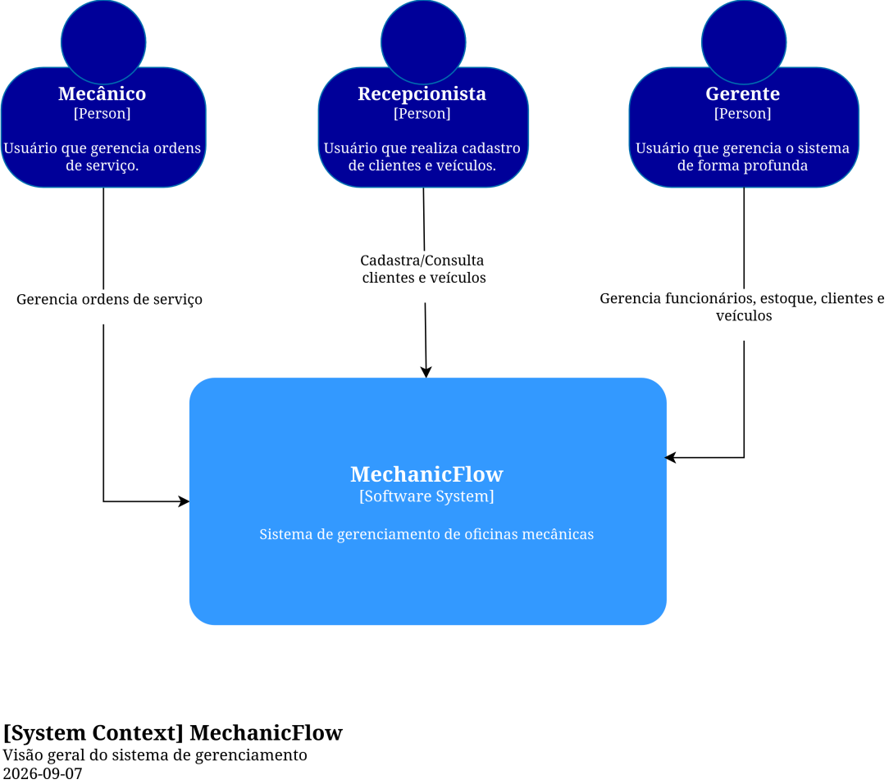
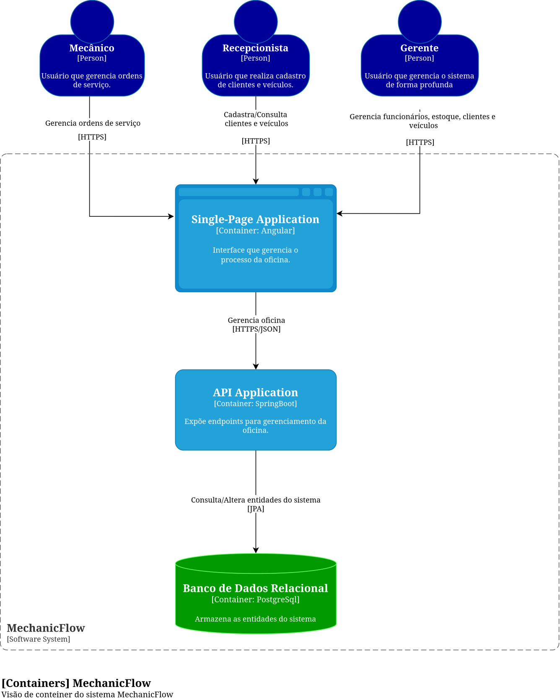
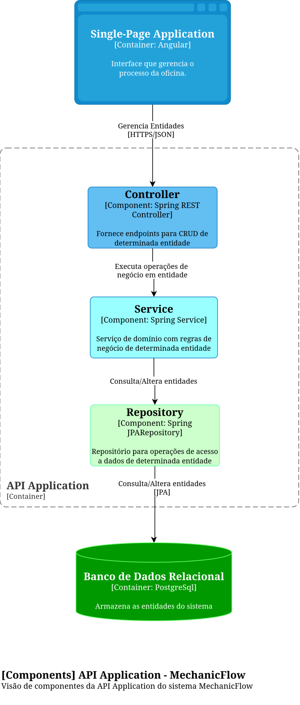

# MechanicFlow — Arquitetura

## 1. Visão arquitetural

O MechanicFlow utiliza uma arquitetura em camadas, separando as responsabilidades de apresentação, lógica de negócio e acesso aos dados.

O frontend é desenvolvido em Angular e é responsável pela interface com o usuário e pela comunicação com o backend. O backend é desenvolvido com Spring Boot e organiza o processamento das requisições nas camadas de Controller, Service e Repository.

A comunicação entre frontend e backend ocorre por meio do protocolo HTTPS, utilizando JSON para representação dos dados. O backend utiliza JPA/JDBC para realizar a comunicação com o banco de dados PostgreSQL.

---

## 2. C4 Model

### 2.1 C1 — System Context



O diagrama C1 apresenta o MechanicFlow em seu contexto geral, identificando o sistema, seus usuários e os sistemas externos com os quais ele se comunica.


### 2.2 C2 — Container



O diagrama C2 apresenta os principais containers que compõem o MechanicFlow.

### 2.3 C3 — Component



O diagrama C3 detalha os principais componentes internos do container Spring Boot.

---

# 3. Architecture Decision Records

## ADR-001 — Arquitetura da aplicação

### Status

Accepted

### Contexto

O MechanicFlow necessita de uma estrutura que permita separar as responsabilidades da aplicação e facilitar sua manutenção e evolução.

### Decisão

Foi adotada uma arquitetura em camadas organizada principalmente da seguinte forma:

```text
Controller → Service → Repository
```

O Controller será responsável pela comunicação HTTP, o Service pela lógica de aplicação e o Repository pelo acesso aos dados.

O domínio será utilizado para representar os conceitos e regras fundamentais do sistema.

### Alternativas consideradas

**Arquitetura em camadas**

Adotada por proporcionar uma separação mais clara de responsabilidades e facilitar testes, manutenção e evolução.

**Arquitetura hexagonal / Clean Architecture**

Considerada, porém não adotada inicialmente devido à complexidade adicional não necessária para o escopo atual do projeto.

## ADR-002 — Banco de dados

### Status

Accepted

### Contexto

O MechanicFlow necessita de um banco de dados capaz de armazenar informações estruturadas relacionadas a clientes, veículos, ordens de serviço, profissionais, peças e estoque.

O domínio apresenta relacionamentos entre diferentes entidades e necessita de persistência consistente dos dados.

### Decisão

Foi escolhido o PostgreSQL como sistema gerenciador de banco de dados relacional.

O acesso ao banco será realizado pelo backend Spring Boot utilizando JPA/JDBC.

### Alternativas consideradas

**MySQL/MariaDB**

Possuem suporte sólido a aplicações relacionais e seriam alternativas tecnicamente viáveis.

**MongoDB**

Foi considerado, porém o domínio do MechanicFlow possui relacionamentos estruturados entre diversas entidades, tornando o modelo relacional mais adequado para a primeira versão do sistema.

**PostgreSQL**

Foi escolhido por oferecer suporte robusto a relacionamentos, integridade referencial, transações e recursos avançados de bancos relacionais.